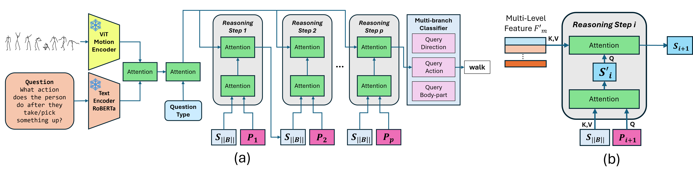

# IMoRe: Implicit Program-Guided Reasoning for Human Motion Q&A

This repository contains the official PyTorch implementation of the paper:

**IMoRe: Implicit Program-Guided Reasoning for Human Motion Q&A**  
Chen Li*, Chinthani Sugandhika*, Yeo Keat Ee, Eric Peh, Hao Zhang, Hong Yang, Deepu Rajan, Basura Fernando
(ICCV 2025) 

<!-- [](https://arxiv.org/abs/2410.22829) -->


## Abstract
Existing human motion Q&A methods rely on explicit program execution, where the requirement for manually defined functional modules may limit the scalability and adaptability. To overcome this, we propose an implicit program-guided motion reasoning (IMoRe) framework that unifies reasoning across multiple query types without manually designed modules. Unlike existing implicit reasoning approaches that infer reasoning operations from question words, our model directly conditions on structured program functions, ensuring a more precise execution of reasoning steps. Additionally, we introduce a program-guided reading mechanism, which dynamically selects multi-level motion representations from a pretrained motion Vision Transformer (ViT), capturing both high-level semantics and fine-grained motion cues. The reasoning module iteratively refines memory representations, leveraging structured program functions to extract relevant information for different query types. Our model achieves state-of-the-art performance on Babel-QA and generalizes to a newly constructed motion Q&A dataset based on HuMMan, demonstrating its adaptability across different motion reasoning datasets.

## Program-Guided Reasoning Process
 for Human Motion Q&A
<div style="display: flex; justify-content: center;">
  
</div>

We split our repository into two sections:
1. IMoRe Models
2. HuMMan Motion Q&A Dataset


## 1. IMoRe Models
Please refer to [`IMoReModels/`](IMoReModels/)


## 2. HuMMan Motion Q&A Dataset
Please refer to [`HuMManQADataset/`](HuMManQADataset/)


## Citation
If you use our code and the HuMManQA dataset for your research, please cite our paper:
```bibtext
To be added...
```

## Acknowledgments

This research/project is supported by the National Research Foundation, Singapore, under its NRF Fellowship (Award\ NRF-NRFF14-2022-0001) and by funding allocation to Basura Fernando by the A*STAR under its SERC Central Research Fund (CRF), as well as its Centre for Frontier AI Research.